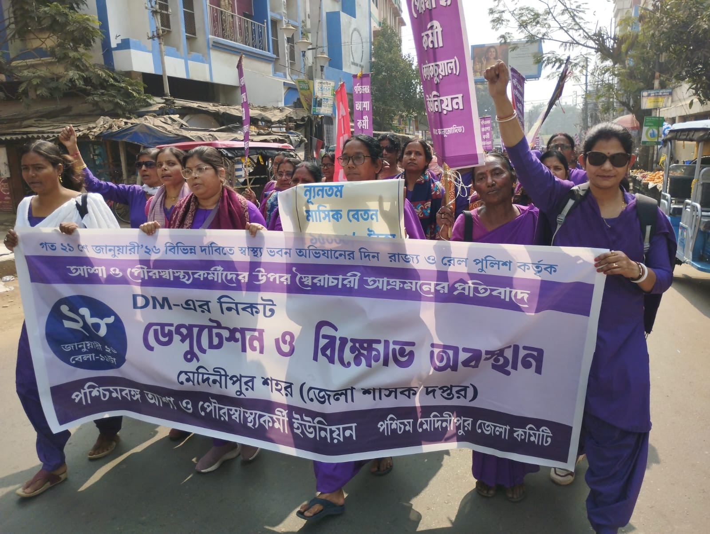
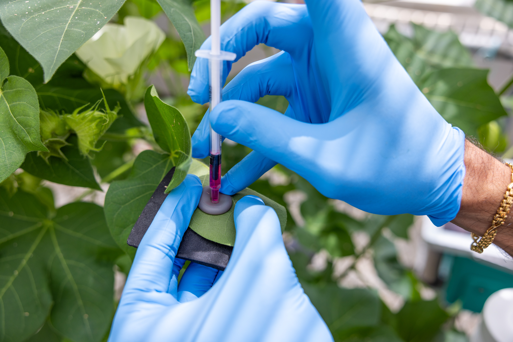

## 
I first started off in this field interested in a deficit-based question, trying to understand why don't people do what we expect them to do in science, health, environment, and risk decision-making. Why do people continue to bathe in the toxic, polluted water of the Ganges River? Why do some visitors who love the environment off-road illegally? I quickly came to realize that was the wrong question. Behaviors that look irrational from the outside are often reasonable responses to the structural and cultural conditions that shape them. Which is why attempts at meaningful social change requires understanding these conditions and  listening to the communities living within them. 

But what does it actually mean to listen? My research is concerned with how participation and voice operate in science, health, risk, and environmental interventions. By that, I mean whose knowledge counts as legitimate, how problems get defined and by whom, who bears responsibility for solutions, and whose experiences of harm are taken seriously. These are not just procedural questions, but questions about power. 

My research has investigating these arrangements across a range of contexts: responsible recreation in national parks, responsible agricultural biotechnology development at research centers, and rural health care delivery in India. Across these projects, I use mixed-methods, from survey research, message design and testing, to ethnographic-based observation, interviews, and textual analysis. 

## Projects

```{=html}
<div style="display: flex; align-items: flex-start; gap: 2rem; margin-bottom: 3rem;">

  <div style="flex: 0 0 38%; max-width: 38%;">
    
    <p style="font-size: 0.85rem; color: #666; text-align: center; margin-top: 0.4rem;">
      ASHAs protesting in Janurary 2026 for better pay, worker rights, and recognition
    </p>
  </div>

  <div style="flex: 1;">
    <h3 style="margin-top: 0;">The Communicative Politics of Community Health Work in Rural India</h3>
    <p>
    Community-based health programs have long been championed as a model for meaningful global development and social change. Yet, the communicative arrangements through which those programs operate can reproduce the very logics they claim to disrupt. My dissertation focuses on India's National Health Mission, the world's largest community health program. I examine the data and reporting infrastructures behind the program, which shapes how problems are defined, which outcomes are recorded, and which behaviors are rewarded, to understand health care delivery on the ground. 
    I draw on three months of ethnographic-based fieldwork with female community healthworkers in rural West Bengal, India, including participant observation, semi-structured interviews, as well as textual analyses of policy documents. This dissertation develops the concept of entangled care, in which geniune benefit and harm go hand in hand, empowerment can come at the cost of marginalization, and coercion is interwinted with care. 
    </p>
    <p style="font-size: 0.85rem; color: #666;">
      <strong>Funding:</strong> 
      Waterhouse Family Institute / $5,600 / 2025
    </p>
        </p>
    <p style="font-size: 0.85rem; color: #666;">
      Cornell's Qualitative and Interpretive Research Institute / $2,000 / 2025
    </p>
    </p>
        </p>
    <p style="font-size: 0.85rem; color: #666;">
    Cornell's Department of Communication / $2,000 / 2025
    </p>


  </div>

</div>

<!-- ── PROJECT 2: Text Left, Image Right ────────────── -->
<div style="display: flex; align-items: flex-start; gap: 2rem; margin-bottom: 3rem;">

  <div style="flex: 0 0 38%; max-width: 38%;">
    
    <p style="font-size: 0.85rem; color: #666; text-align: center; margin-top: 0.4rem;">
      Injecting a plant with a synthetic RUBY gene
    </p>
  </div>

  <div style="flex: 1;">
    <h3 style="margin-top: 0;">Upstream Engagement in Emerging Agricultural Biotechnologies</h3>
    <p>
      As climate change accelerates, research centers are turning to digital and technological solutions to make agricultural systems more sustainable and efficient. But who gets to shape those solutions, and whose priorities get built into them from the start, is rarely asked early enough. This project intervenes at that moment before technologies are developed and distributed, when public input can feedback into research decisions. 
     
      Working with <a href="https://cropps.cornell.edu">CROPPS</a>  collaborators across Cornell University, the University of Illinois, and the University of Arizona, we engaged a diverse set of stakeholders to understand the ethical and social implications of emerging agricultural biotechnologies and what more responsible, responsive science might look like. This included fieldwork with migrant farmworkers at 2 AM at the U.S.-Mexico border, in partnership with Campesino Sin Fronteras (a local farmworker organization) to understand the particular challenges of including marginalized communities in these conversations. We conducted surveys at the Slow Food Terra Madre international food festival to understand how sustainably-minded consumers, growers, and producers think about these innovations. We also engaged with traditional agricultural stakeholders (plant scientists, large-scale growers). 
    </p>
    <p>
      <strong>Papers:</strong>
      <a href="https://doi.org/10.1007/s13280-026-02383-1
">Insights for inclusive upstream engagement with migrant farmworkers in agriculture: A case study from the US–Mexico border</a>
    </p>
    <p style="font-size: 0.85rem; color: #666;">
      <strong>Grants:</strong> Science and Technology Center: Center for Research on Programmable Plant Systems / National Science Foundation
    </p>
  </div>

</div>

<!-- ── PROJECT 3: Image Left, Text Right ────────────── -->
<div style="display: flex; align-items: flex-start; gap: 2rem; margin-bottom: 3rem;">

 <div style="flex: 0 0 38%; max-width: 38%;">
    
    <p style="font-size: 0.85rem; color: #666; text-align: center; margin-top: 0.4rem;">
      Off-roading at Berdoo Canyon Road, Joshua Tree National Park
    </p>
  </div>

  <div style="flex: 1;">
    <h3 style="margin-top: 0;">Community-Centered Off-Road Management in Joshua Tree National Park </h3>
    <p>
      Off-roaders are often framed as a problem in conservation, but that framing misses the fact that these communities have their own deep relationships with land, their own definitions of responsible recreation, and their own sense of what the problems in wilderness areas are. In partnership with Joshua Tree National Park and The Living Desert, we worked to understand off-roaders' perceptions and design conservation messaging that could speak to this community.
    </p>
    <p style="font-size: 0.85rem; color: #666;">
      <strong>Grants:</strong> California State Parks Off-Highway Motor Vehicle Recreation Grant / $114,625 (Unfunded) / 2024
    </p>
  </div>

</div>

  ...

```

<!-- ── PROJECT 1: Image Left, Text Right ────────────── -->

:::